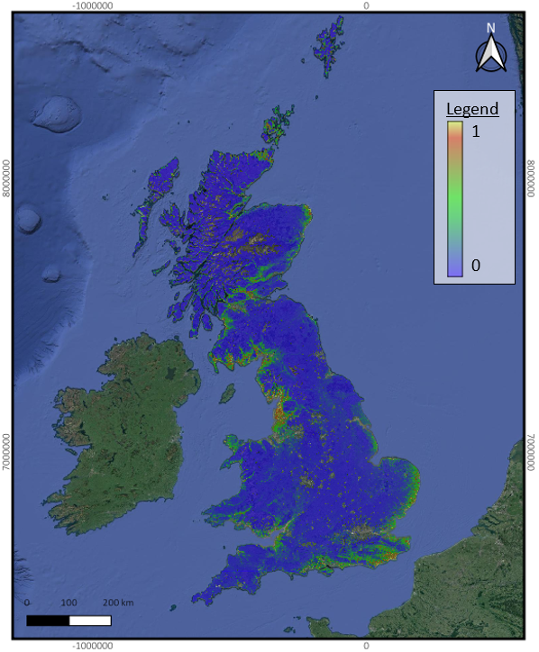

# Species Distribution Modeling Using Maximum Entropy (Maxent)

This repository contains the results from a Maxent model predicting the distribution of Natterjack Toads within Great Britain.
Maxent utilises entropy within given data (occurrence records and environmental variables) to calculate geographical probabilities in the form of distribution maps.

## Project Overview
This model was performed as part of the completion of my undergraduate dissertation: "Investigating Natterjack Toad (Epidelea calamita) Habitats in Great Britain: Maxent Predictions and Field Analysis." For which I achieved a 1st.

## Occurence Records and Variable Selection
Both Occurence Records and Variable selection needed to be specifically seleceted to meet the criteria and increase the models accuracy before being processed.

**Occurence data** was sourced from NBN Atlas, on the 27th of October 2023. Providing 40,380 occurence points which, dating back to the year 1800. To increase model accuracy the occurence points were narrowed down to 365 accepted records since 1990, with coordinate accuracys of <100m, to maintain accurate training of the model

**Environmental variables** were selected based on their availability and perceived ecological impact related to the Natterjack toad, based on previous research as well as their availability. The full list of environmental variables, their data format, and their data sources can be seen below:
- Topsoil carbon concentration - NERC Environmental Information Data Centre - Vector
- Topsoil pH levels - NERC Environmental Information Data Centre - Vector
- Topsoil moisture levels - NERC Environmental Information Data Centre - Vector
- Annual mean temperature - WorldClim 2.1 - Raster
- Temperature seasonality - WorldClim 2.1 - Raster
- Temperature annual range - WorldClim 2.1 - Raster
- Annual precipitation - WorldClim 2.1 - Raster
- Precipitation seasonality - WorldClim 2.1 - Raster
- Precipitation of driest quarter - WorldClim 2.1 - Raster
- Precipitation of wettest quarter - WorldClim 2.1 - Raster
- Isothermality - WorldClim 2.1 - Raster
- Elevation - WorldClim 2.1 - Raster
- GB Land cover map 2021 - EDINA Environmental Digimap Service - Raster

## Data Processing
Variables were visualised and processed using  QGIS (Version 3.34.1) and the Geospatial Data Abstraction Library (GDAL) OSGeo4W shell so that all the necessary information could be accessed by Maxent and so that the geographical dimensions remained consistent.

The Maxent settings, features and regularisation multiplier used were determined using RStudio (Version 2023.12.0+369), following the tutorial from Banta(2019).

## Results
The Maxent Model produced several outputs, including a habitat suitability map, AUC (Area Under Curve) Graphs and Omission rates.

- **Species Distribution map:** Displays regions of high suitability in warmer colours and those of a lower suitability in cooler colours.

Visualised in QGIS (Version 3.34.1)
- **AUC (Area Under Curve) graph:** Provides a metric by which the accuracy of the model can be assessed, the closer the values are to 1, the more accurate.
- **Omission Rates graph** Shows the rate at which the model fails to predict the presence of the species.

